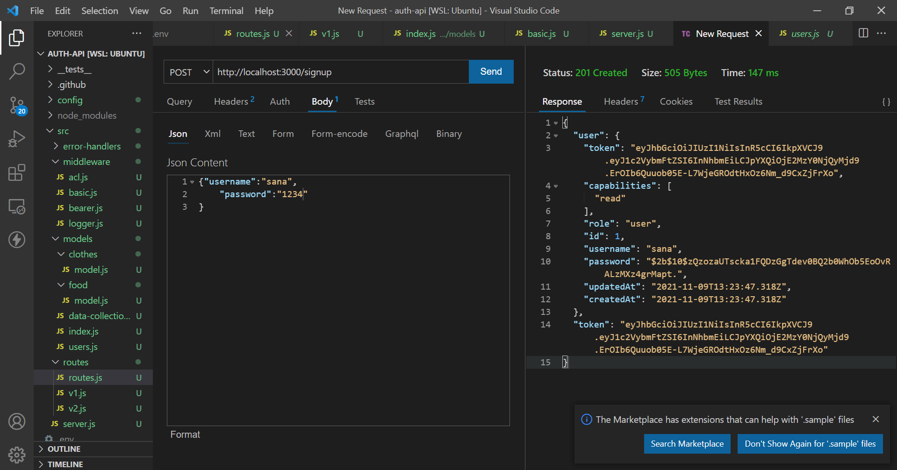

# auth-api
## LAB - 08
### Authentication 
Author: Sana Ishaqat

[tests report (actions)](https://github.com/SanaIshaqat/auth-api/actions)

[back-end (heroku)](https://sana-auth-api-401.herokuapp.com)

[PR Link]https://github.com/SanaIshaqat/auth-api/pull/1)

### Setup
.env requirements
PORT - Port Number

### Running the app
npm run dev
Endpoint: /status
Returns Object
{
  "status": "running",
  "port": 3030,
  "domain": "https://sana-auth-api-401.herokuapp.com"
}

### Tests
Unit Tests: npm run test

### ThunderClientTests

### v-2 Admin 

## SignIn Sign Up Endpoints

## Food & Clothes

